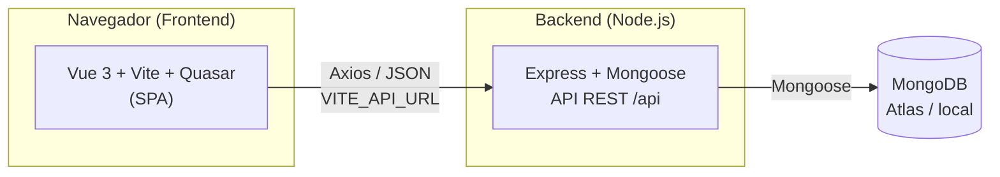

# CursemIA — Documentación Técnica

Documentación de cómo funciona el **backend**, cómo funciona el **frontend**, cómo se **relacionan**, y **qué tecnologías se usaron y por qué**.

---

## 0. Visión general

CursemIA es una plataforma educativa con **tres roles**: **Aprendiz**, **Docente** y **Coordinador**. Está compuesta por dos aplicaciones independientes que se comunican por HTTP (API REST):



| Capa | Tecnología | Puerto / URL |
|------|-----------|--------------|
| Frontend | Vue 3 + Vite + Quasar | `http://localhost:5173` (dev) |
| Backend | Node.js + Express + Mongoose | `http://localhost:4000/api` |
| Base de datos | MongoDB (local o Atlas) | `mongodb://...` |

---

## 1. Backend

### 1.1 Tecnologías y por qué

| Tecnología | Por qué se usó |
|------------|----------------|
| **Node.js** | Mismo lenguaje (JavaScript) en frontend y backend; ligero y rápido para una API educativa. |
| **Express** | Framework minimalista para definir rutas y middlewares con muy poco código. |
| **Mongoose** | ODM que da **esquemas, validaciones y relaciones** sobre MongoDB. |
| **MongoDB** | Base de datos NoSQL flexible (documentos JSON), ideal para prototipos y para modelar cursos/trabajos/entregas. |
| **CORS** | Permite que el frontend (otro puerto/dominio) consuma la API. |
| **dotenv** | Carga variables de entorno (`.env`) sin hardcodear credenciales. |
| **nodemon** (dev) | Reinicia el servidor automáticamente al guardar (solo desarrollo). |

### 1.2 Estructura (patrón MVC)

```
Backend/
├── .env                  # Variables de entorno (PORT, MONGODB_URI) — NO se sube a git
├── package.json          # Dependencias y scripts (start / dev / seed)
├── seed-demo.mjs         # Script de datos de prueba (lee el .env)
└── src/
    ├── index.js          # Punto de entrada: conecta a Mongo y levanta el server
    ├── app.js            # Config de Express: middlewares y montaje de rutas
    ├── config/
    │   └── db.js         # Conexión a MongoDB (Mongoose)
    ├── models/           # MODELOS     (M de MVC)
    ├── controllers/      # CONTROLADORES (C de MVC)
    └── routes/           # Rutas / endpoints
```

### 1.3 Arranque (`src/index.js`)

```js
import 'dotenv/config'
import app from './app.js'
import conectarDB from './config/db.js'

const PORT = process.env.PORT || 4000

conectarDB()               // 1) conecta a MongoDB
  .then(() => app.listen(PORT, ...))  // 2) solo si conecta, levanta el server
  .catch((e) => process.exit(1))
```

- Escucha en `process.env.PORT` (Render lo inyecta) o `4000` en local.
- Si Mongo no conecta, el proceso termina (`process.exit(1)`).

### 1.4 Middlewares y montaje (`src/app.js`)

```js
app.use(cors())          // permite peticiones desde el frontend
app.use(express.json())  // parsea el body JSON

app.use('/api/aprendices', aprendizRoutes)
app.use('/api/profesores', profesorRoutes)
app.use('/api/cursos',     cursoRoutes)
app.use('/api/trabajos',   trabajoRoutes)
app.use('/api/entregas',   entregaRoutes)
app.use('/api/solicitudes', solicitudRoutes)
```

La ruta `GET /` devuelve un JSON de bienvenida con las rutas disponibles.

### 1.5 Modelos

| Modelo | `_id` | Campos principales |
|--------|-------|--------------------|
| **Aprendiz** | Cédula (String) | `nombre`, `apellido`, `correo` (único), `contrasena`, `telefono`, `fechaNacimiento`, `cursos[]` (refs a `Curso`) |
| **Profesor** | Cédula (String) | `nombre`, `apellido`, `correo` (único), `contrasena`, `telefono`, `fechaNacimiento`, `cursos[]` (refs a `Curso`) |
| **Curso** | ObjectId | `nombre`, `fechaInicio`, `fechaFin`, `modalidad` (`virtual`/`presencial`), virtual `cantidadEstudiantes` |
| **Trabajo** | ObjectId | `curso` (ref), `titulo`, `descripcion`, `fechaLimite` |
| **Entrega** | ObjectId | `trabajo` (ref), `aprendiz` (cédula), `fechaEntrega`. Índice único `(trabajo, aprendiz)` |
| **Solicitud** | ObjectId | `aprendizCedula`, `aprendizNombre`, `cursoNombre`, `docenteNombre`, `tipoId`, `numeroId`, `correo`, `aceptaDatos`, `estado` (`pendiente`/`aprobada`/`rechazada`). Índice único `(aprendizCedula, cursoNombre)` |

> **Nota importante:** el `_id` de Aprendiz y Profesor es la **cédula** (String), por eso el login "busca por cédula".

### 1.6 Endpoints

#### Aprendices (`/api/aprendices`)
| Método | Ruta | Descripción |
|--------|------|-------------|
| POST | `/login` | Login educativo (crea el aprendiz si no existe) |
| GET | `/:id/dashboard` | Cursos del aprendiz + trabajos con estado `entregado` |
| GET | `/` | Listar aprendices (con `cursos` populados) |
| GET | `/:id` | Obtener un aprendiz |
| POST | `/` | Crear |
| PUT | `/:id` | Actualizar |
| DELETE | `/:id` | Eliminar |

#### Profesores (`/api/profesores`)
| Método | Ruta | Descripción |
|--------|------|-------------|
| POST | `/login` | Login educativo (crea el profesor si no existe) |
| GET | `/:id/trabajos` | Trabajos de sus cursos + entregas por trabajo |
| GET | `/` | Listar |
| GET | `/:id` | Obtener (con `cursos` populados) |
| POST / PUT / DELETE | `/`, `/:id` | CRUD |

#### Cursos (`/api/cursos`)
CRUD completo (`GET /`, `GET /:id`, `POST /`, `PUT /:id`, `DELETE /:id`). `GET /` incluye `cantidadEstudiantes`.

#### Trabajos (`/api/trabajos`)
`GET /?curso=<id>`, `GET /:id`, `POST /`, `PUT /:id`, `DELETE /:id`.

#### Entregas (`/api/entregas`)
`GET /?trabajo=<id>&aprendiz=<cedula>`, `GET /:id`, `POST /`, `DELETE /:id`.

#### Solicitudes (`/api/solicitudes`)
| Método | Ruta | Descripción |
|--------|------|-------------|
| POST | `/` | El aprendiz crea una solicitud (estado `pendiente`; 409 si ya existe) |
| GET | `/` | Todas las solicitudes |
| GET | `/resumen` | Conteos por curso (`aprobadas`, `pendientes`, `rechazadas`, `total`) vía *aggregation* |
| GET | `/aprendiz/:cedula` | Solicitudes de un aprendiz |
| GET | `/docente/:nombre` | Solicitudes cuyo `docenteNombre` coincide con el docente |
| PUT | `/:id/estado` | Cambia el estado (`aprobada` / `rechazada` / `pendiente`) |

### 1.7 Login "educativo"

No hay hash de contraseña ni JWT. El login **busca por cédula**; si no existe, **crea el usuario** con los datos enviados:

```js
let aprendiz = await Aprendiz.findById(_id)
if (aprendiz) return res.json({ aprendiz, creado: false })
aprendiz = new Aprendiz({ _id, nombre, apellido, correo, contrasena })
await aprendiz.save()
```

> Es un login **solo educativo**: la contraseña no se valida contra nada.

---

## 2. Frontend

### 2.1 Tecnologías y por qué

| Tecnología | Por qué se usó |
|------------|----------------|
| **Vue 3** (`<script setup>`) | Framework reactivo y por componentes; API de composición simple. |
| **Vite** | Build tool ultrarrápido, con HMR en desarrollo. |
| **Quasar** | Biblioteca de componentes Material (botones, inputs, tabs, listas, diálogos) + sistema de layout. Ahorra muchísimo trabajo de UI. |
| **Vue Router** (hash) | Navegación SPA. Se usa `createWebHashHistory` (`#/...`) para que funcione en hosting estático sin configurar rewrites. |
| **Pinia** | Estado global (usuario logueado). |
| **pinia-plugin-persistedstate** | Persiste la sesión en `localStorage` (sobrevive al recargar). |
| **Axios** | Cliente HTTP con `baseURL` configurable y buen manejo de errores. |
| **@quasar/extras** | Iconos Material Icons. |

### 2.2 Estructura

```
Frontend/
├── .env                  # VITE_API_URL (URL del backend)
├── vite.config.js        # Plugin de Vue + Quasar
└── src/
    ├── main.js           # Bootstrap: Pinia, Quasar, Router, montaje
    ├── App.vue           # <router-view/> + variables CSS (:root) + clase .header-app
    ├── style.css
    ├── api/axios.js      # Instancia de Axios (baseURL = VITE_API_URL)
    ├── stores/auth.js    # Store de sesión (persistente)
    ├── routes/routes.js  # Definición de rutas
    ├── data/             # Datos estáticos (catálogo de cursos, cursos del coordinador)
    ├── utils/cursos.js   # Helpers (color determinista por curso)
    ├── components/       # Layouts y componentes reutilizables
    └── views/            # Páginas por rol
```

### 2.3 Bootstrap (`main.js`)

```js
import '@quasar/extras/material-icons/material-icons.css'
import 'quasar/src/css/index.sass'

const app = createApp(App)
app.use(pinia)
app.use(Quasar, { plugins: { Notify } })  // Notify para mensajes flotantes
app.use(router)
app.mount('#app')
```

### 2.4 Cliente HTTP (`api/axios.js`)

```js
const api = axios.create({
  baseURL: import.meta.env.VITE_API_URL || 'http://localhost:4000/api',
})
```

Todas las peticiones al backend pasan por esta instancia. La URL se controla con la variable de entorno `VITE_API_URL` (se "hornea" en el build).

### 2.5 Estado global (`stores/auth.js`)

```js
export const useAuthStore = defineStore('auth', {
  state: () => ({ usuario: null }),   // { rol, cedula, nombre, apellido, correo, cursos }
  getters: { estaLogueado: (s) => !!s.usuario },
  actions: { setUsuario(u) { this.usuario = u }, logout() { this.usuario = null } },
  persist: true,                      // se guarda en localStorage
})
```

### 2.6 Rutas (`routes/routes.js`)

Cada rol tiene su **layout** (navbar propia) y sus **vistas hijas** anidadas:

| Ruta | Rol | Vista |
|------|-----|-------|
| `/` | Público | `MainPage` (landing) |
| `/cursos` | Público | `CursosView` (catálogo) |
| `/faqs` | Público | `FaqsView` |
| `/login/alumno` · `/login/docente` · `/login/coordinador` | — | Logins |
| `/dashboard/alumno` | Aprendiz | Layout + `AlumnoMisCursos` (hijos: `tareas`, `cronograma`, `calificaciones`, `cursos`, `curso/:nombre`) |
| `/dashboard/docente` | Docente | Layout + `DocenteMisCursos` (hijos: `trabajos`, `solicitudes`) |
| `/dashboard/coordinador` | Coordinador | Layout + `CoordinadorCursosActivos` (hijos: `curso/:id`, `estudiantes`) |

### 2.7 Tema y estilos

- Variables CSS en `App.vue` (`:root`): `--color-principal`, `--color-secundario` (`#000b20`), `--color-terciario`, `--color-neutro`.
- Clase global **`.header-app`** para la navbar (mismo tono oscuro del fondo).
- Las vistas oscuras fijan `background: var(--color-secundario)`.

---

## 3. Relación Frontend ↔ Backend

### 3.1 Mapa de vistas/componentes → endpoints

| Aspecto del frontend | Archivo | Endpoint(s) del backend | Qué hace |
|----------------------|---------|--------------------------|----------|
| Login aprendiz | `LoginForm.vue` | `POST /aprendices/login` | Autentica/crea aprendiz |
| Login docente | `LoginForm.vue` | `POST /profesores/login` | Autentica/crea profesor |
| Login coordinador | `LoginCoordinador.vue` | — (solo frontend) | Setea `rol: 'coordinador'` en el store |
| Catálogo de cursos | `CursosCatalogo.vue` | `POST /solicitudes` | Muestra cursos (datos estáticos) e inscribe |
| Inscribirse (modal) | `CursosCatalogo.vue` | `POST /solicitudes` | Crea la solicitud `pendiente` |
| Mis cursos (aprendiz) | `AlumnoMisCursos.vue` | `GET /aprendices/:cedula/dashboard` + `GET /solicitudes/aprendiz/:cedula` | Cursos inscritos + solicitudes pendientes |
| Mis tareas | `AlumnoMisTareas.vue` | `GET /aprendices/:cedula/dashboard` | Trabajos con estado entregado |
| Cronograma | `AlumnoCronograma.vue` | `GET /aprendices/:cedula/dashboard` | Fechas límite (trabajos) + clases de ejemplo |
| Detalle de curso (aprendiz) | `AlumnoCursoDetalle.vue` | — (datos estáticos + simulación) | Info del curso y trabajos |
| Mis cursos (docente) | `DocenteMisCursos.vue` | `GET /solicitudes/resumen` | Cursos que dicta + conteo de inscritos |
| Trabajos asignados (docente) | `DocenteTrabajos.vue` | `GET /profesores/:cedula/trabajos` | Trabajos y entregas |
| Solicitudes (docente) | `DocenteSolicitudes.vue` | `GET /solicitudes/docente/:nombre` + `PUT /solicitudes/:id/estado` | Ver y aprobar/rechazar |
| Cursos activos (coordinador) | `CoordinadorCursosActivos.vue` | `GET /solicitudes/resumen` | Conteo de inscritos por curso |
| Detalle de curso (coordinador) | `CoordinadorCursoDetalle.vue` | `GET /solicitudes/docente/:docente` | Estudiantes + promedios (simulados) |
| Estudiantes (coordinador) | `CoordinadorEstudiantes.vue` | `GET /aprendices` + `GET /solicitudes` | Lista de estudiantes y sus cursos |
| Landing / FAQs | `MainPage.vue`, `FaqsView.vue` | — | Contenido estático |

### 3.2 Flujos completos

#### Flujo de Login
```
LoginForm.vue
  → POST /api/{aprendices|profesores}/login  (cédula, nombre, apellido, correo, contraseña)
  → backend busca por _id (cédula); si no existe lo crea
  → { aprendiz|profesor }
  → auth.setUsuario({ rol, cedula, nombre, ... })   (Pinia, persistido)
  → router.push('/dashboard/{alumno|docente}')
```

#### Flujo de Inscripción (opción simple)
```
CursosCatalogo.vue (modal)
  → POST /api/solicitudes  { aprendizCedula, cursoNombre, docenteNombre, ... }
  → estado = "pendiente"   (índice único aprendiz+curso)
```
```
DocenteSolicitudes.vue
  → GET /api/solicitudes/docente/:nombre        (filtra por coincidencia de nombre)
  → PUT /api/solicitudes/:id/estado  { estado: "aprobada" | "rechazada" }
```
```
AlumnoMisCursos.vue
  → GET /api/solicitudes/aprendiz/:cedula
  → los cursos con estado "aprobada" se cruzan con el catálogo estático
```

#### Flujo del Coordinador (conteos)
```
CoordinadorCursosActivos.vue
  → GET /api/solicitudes/resumen  →  [{ cursoNombre, aprobadas, ... }]
  → conteo mostrado = estudiantesBase (estático) + aprobadas (backend)
```

### 3.3 Dato estático vs dato real (importante)

Para simplificar la demo, **parte de la información es estática en el frontend** y otra viene del backend:

| Dato | Origen |
|------|--------|
| Catálogo de 15 cursos, docentes, modalidades, fechas | **Estático** (`src/data/cursosCatalogo.js`) |
| Cursos "activos" del coordinador, %, `estudiantesBase` | **Estático** (`src/data/cursosCoordinador.js`) |
| Aprendices, profesores, solicitudes, entregas, trabajos | **Backend (MongoDB)** |
| Promedios, tareas entregadas, cronograma | **Simulados** deterministas (`utils` + lógica local) |

> Los cursos **no están en MongoDB**: viven como datos estáticos. Por eso la inscripción usa **nombres de curso/docente como texto** (la "opción simple").

---

## 4. Despliegue (Render + MongoDB Atlas)

Se despliegan **dos servicios**:

1. **Backend → Web Service**
   - Root Directory: `Backend`
   - Build: `npm install` · Start: `npm start`
   - Env: `MONGODB_URI` = cadena de **Atlas** (`...mongodb.net/cursemIA?authSource=admin...`)
2. **Frontend → Static Site**
   - Root Directory: `Frontend`
   - Build: `npm install && npm run build` · Publish: `dist`
   - Env: `VITE_API_URL` = `https://TU-BACKEND.onrender.com/api`

**Datos de prueba:** `npm run seed` (script `seed-demo.mjs`) puebla la base apuntada por `MONGODB_URI`. Es idempotente.

> El backend gratuito de Render "duerme" tras ~15 min sin uso (primer request lento).

---

## 5. Cómo ejecutar en local

```bash
# Backend
cd "tercer proyecto/Backend"
npm install
npm run dev          # nodemon en http://localhost:4000

# Frontend (otra terminal)
cd "tercer proyecto/Frontend"
npm install
npm run dev          # Vite en http://localhost:5173
```

`.env` del backend: `PORT=4000` y `MONGODB_URI=<tu conexión>`.
`.env` del frontend: `VITE_API_URL=http://localhost:4000/api`.

---

## 6. Resumen de decisiones de diseño

| Decisión | Motivo |
|----------|--------|
| **MVC en el backend** | Separar modelos, controladores y rutas → código ordenado y escalable. |
| **`_id` = cédula** | La cédula es el identificador natural del usuario; evita IDs extra. |
| **Login educativo (auto-registro)** | Facilita las pruebas y la demo, sin gestionar credenciales reales. |
| **Hash Router** | Funciona en hosting estático (Render) sin configurar rewrites. |
| **Pinia persistente** | Mantener la sesión entre recargas sin backend de sesiones. |
| **Catálogo estático + inscripción por texto** | Evita sembrar cursos/profesores en la BD; suficiente para el alcance educativo. |
| **Datos simulados (promedios, tareas)** | El backend no guarda calificaciones; se simulan de forma determinista para que la UI sea rica. |
| **Quasar** | Componentes listos (tabs, diálogos, listas, inputs) → UI consistente en poco tiempo. |
| **`.header-app` con mayor especificidad** | Vencer la regla de Quasar `.q-layout__section--marginal` que pinta el header con el color primario. |
